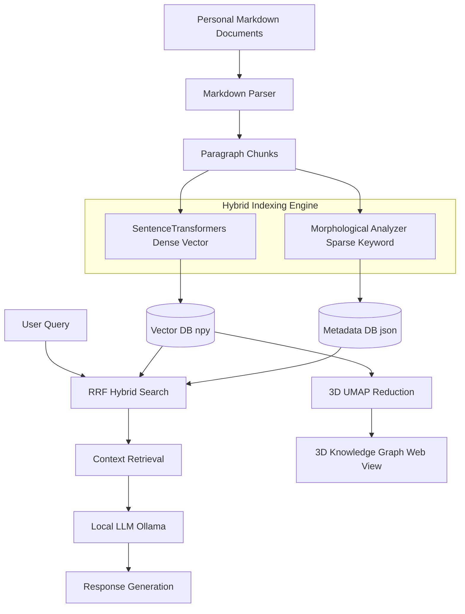

# LocalMind

LocalMind is a private-first RAG (Retrieval-Augmented Generation) system designed to perform hybrid (vector + keyword) semantic searches and interactive local LLM queries over personal Markdown knowledge bases offline, with 3D knowledge graph visualizations.

## Architecture and System Flow



## Key Features

### Hybrid Search & Local LLM RAG

- **Hybrid Search**: Combines semantic search (Dense Vector) and traditional keyword matching (BM25) using the Reciprocal Rank Fusion (RRF) algorithm to ensure superior Korean search accuracy.
- **Local LLM Response Generation**: Integrates with a local Ollama service (defaulting to `qwen2.5-coder:14b`) to generate context-aware, reliable answers based on the retrieved document segments.
- **100% Offline Execution**: All inference tasks and data indexing are processed entirely on your local machine, protecting your private files and knowledge bases from external data leaks.

### Korean NLP Optimization

- **Morphological Analysis**: Built-in integration with the Kiwi morphological analyzer (`kiwipiepy`) for advanced tokenization and Korean particle removal.
- **Custom Dictionary Support**: Seamlessly links with the external [Personal-Dictionary](file:///home/lee/Documents/code_personal/Personal-Dictionary/README.md) package to prevent technical terms or project-specific jargon (e.g., 3DGS, COLMAP) from being broken down during indexing.

### Markdown Preprocessing & Chunking

- **Noise Filtering**: Cleans raw Markdown files by stripping code blocks, formatting tags, image syntax, and simplifying links to optimize embedding and search index quality. It also filters out Markdown alert blocks (e.g., `[!NOTE]`, `[!WARNING]`) to avoid semantic distortion.
- **Folder-based Categories**: Automatically extracts subfolder directory structures and saves them as `categories` metadata, allowing multi-dimensional category-based filtering.

### 3D Knowledge Visualization

- **3D Interactive Graph**: Visualizes document relationships in an interactive 3D web interface using UMAP dimensionality reduction and Plotly.js.
- **Real-time Navigation**: Highlights nodes by keywords, adjusts node sizes by character density, and displays a Markdown preview panel when a node is clicked in the browser.

---

## Data Storage Structure

- **Vector Database**: `data/localmind-db.vectors.npy` (Stores high-dimensional dense vector embeddings)
- **Metadata Database**: `data/localmind-db.json` (Stores text chunks, source paths, and category metadata)

*Note: Existing databases (`thought-search-db.json` and `thought-search-db.vectors.npy`) will be automatically migrated to the `localmind-db` structure on execution.*

*For detailed performance benchmarks and C++ native optimization details, refer to [docs/cpp-acceleration-report.md](file:///home/lee/Documents/code_personal/Thought-Search/docs/cpp-acceleration-report.md).*

---

## Installation & Setup

### 1. Environment Setup (Conda)

```bash
# Create and activate environment
conda create -n localmind python=3.10 -y
conda activate localmind

# Install dependencies
pip install -r requirements.txt

# Install Custom Dictionary Manager (Optional but Recommended)
# Path should be the directory where you cloned the Personal-Dictionary repository
pip install -e /path/to/Personal-Dictionary
```

### 2. Environment Variables Configuration

The configuration loader prioritizes the `LOCAL_MIND_` prefix, while retaining fallback support for `THOUGHT_SEARCH_` environment variables.

```bash
# Path to your Markdown knowledge base (Defaults to: posts/)
export LOCAL_MIND_POSTS="/path/to/your/knowledge-base"

# Local Ollama connection configuration
export LOCAL_MIND_OLLAMA_HOST="http://localhost:11434"
export LOCAL_MIND_OLLAMA_MODEL="qwen2.5-coder:14b"
```

Available environment variables are listed below:

| Environment Variable (Priority 1) | Legacy Variable (Fallback) | Default Value | Description |
| :--- | :--- | :--- | :--- |
| `LOCAL_MIND_POSTS` | `THOUGHT_SEARCH_POSTS` | `posts` | Target directory containing Markdown files |
| `LOCAL_MIND_MODEL` | `THOUGHT_SEARCH_MODEL` | `jhgan/ko-sroberta-multitask` | HuggingFace model for generating dense embeddings |
| `LOCAL_MIND_RERANK_MODEL` | `THOUGHT_SEARCH_RERANK_MODEL` | `cross-encoder/mmarco-mMiniLMv2-L12-H384-v1` | Re-ranking model for search optimization |
| `LOCAL_MIND_MAX_CHUNK` | `THOUGHT_SEARCH_MAX_CHUNK` | `800` | Maximum character length of a single text chunk |
| `LOCAL_MIND_OVERLAP` | `THOUGHT_SEARCH_OVERLAP` | `200` | Overlap character length between contiguous chunks |
| `LOCAL_MIND_OLLAMA_HOST` | `THOUGHT_SEARCH_OLLAMA_HOST` | `http://localhost:11434` | Endpoint for the local Ollama API server |
| `LOCAL_MIND_OLLAMA_MODEL` | `THOUGHT_SEARCH_OLLAMA_MODEL` | `qwen2.5-coder:14b` | Ollama model name to use for RAG responses |
| `LOCAL_MIND_RELEVANCE_THRESHOLD` | `THOUGHT_SEARCH_RELEVANCE_THRESHOLD` | `0.5` | Minimum similarity score required for RAG context |
| `LOCAL_MIND_SYNC_TOKEN` | `THOUGHT_SEARCH_SYNC_TOKEN` | `""` | Security token to authorize web-triggered database syncs |

### 3. Local LLM Setup (Ollama)

1. Download and install [Ollama](https://ollama.com/).
2. Pull the default language model for coding and general RAG:

   ```bash
   ollama pull qwen2.5-coder:14b
   ```

### 4. Running the System

The easiest way to index and search is to run the automated shell script:

```bash
# 1. Interactive terminal search (auto-indexes and starts prompt)
./run.sh

# 2. Perform a direct, one-shot search
./run.sh "How to install Kubernetes?"

# 3. Retrieve context and generate a local LLM response using RAG
./run.sh "How to install Kubernetes?" --rag

# 4. Launch the 3D visualization and web search server (Access at: http://localhost:8080)
./run.sh --viz
```

#### Manual Pipeline Execution via Python CLI

```bash
# Step 1. Parse and index Markdown files to build the vector store
python src/cli/indexer.py

# Step 2. Search via terminal CLI
python src/cli/search.py "Your query here"

# Step 3. Execute a query with Ollama RAG integration
python src/cli/search.py "Your query here" --rag
```

---

## Directory Structure

- `data/`: Contains database json, vector npy, and keywords list.
- `posts/`: Default directory for source Markdown documents.
- `src/`: Application source directory.
  - `core/`: Core retrieval algorithms, database connectors, and visualization API servers.
  - `cli/`: Executable python scripts for indexing and terminal searches.
  - `viz/`: Dimensionality reduction scripts and static web assets.
